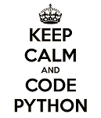

# Just-Fun-with-Python 
**_In which we makes random number generation function like R-software and some statistical function_**

### [Vinayak Sable](https://www.linkedin.com/in/vinayak-sable-675502131) -Student of Shivaji University

## Random Number Generation

### Univariate Distributions

+ ``rbeta``                 - Beta distribution over ``[0, 1]``.
+ ``rbinom``                - Binomial distribution.
+ ``rexp``                  - Exponential distribution.
+ ``rgamma``                - Gamma distribution.
+ ``rgeom``                 - Geometric distribution.
+ ``rhyper``                - Hypergeometric distribution.
+ ``rlaplace``              - Laplace distribution.
+ ``rnbinom``               - Negative binomial distribution.
+ ``rnorm``                 - Normal / Gaussian distribution.
+ ``rpois``                 - Poisson distribution.
+ ``runif``                 - Uniform distribution.
+ ``rweibull``              - Weibull distribution.
+ ``gendis``                - General discrete distribution

### Multivariate Distributions
+ ``rmultin``              - Multivariate generalization of the binomial distribution.

## Statistical Function
+ ``mode``- mode of array
+ ``median``- median of array
+ ``avg`` - mean of array
+ ``var``- variance of array 
+ ``cov``- covariance between two array
+ ``corr``- correlation between two array

@github/support What do you think about these ?
